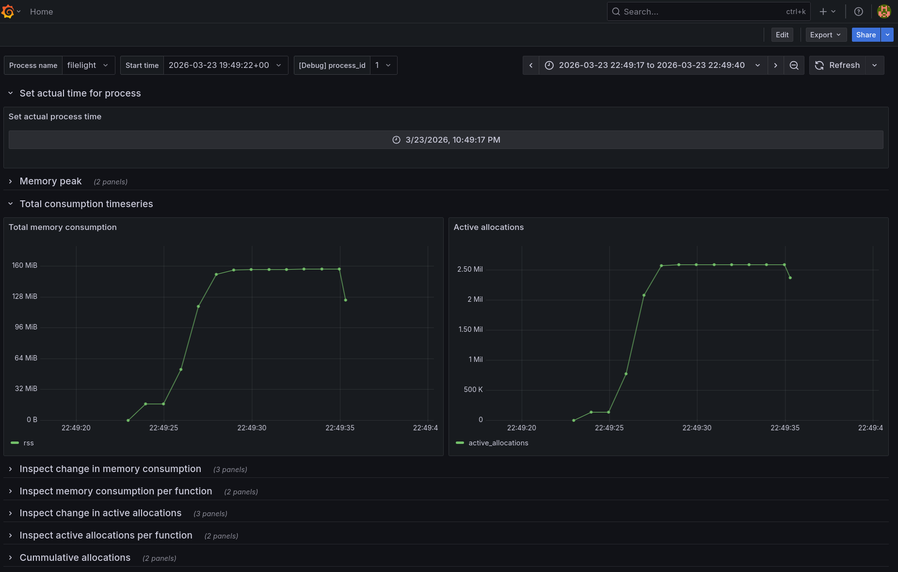

# MemHawk

[](LICENSE)
[](https://en.cppreference.com/)
[](https://github.com/IlRomanenko/MemHawk/actions)
[](https://github.com/IlRomanenko/MemHawk/actions)
[](https://github.com/IlRomanenko/MemHawk/actions)

## Overview

MemHawk traces all memory allocations and summarizes them by stack traces. It helps you quickly identify the top-N memory allocation traces that are consuming the most memory — perfect for tracking down leaks in your application.


## Features

| Feature | Description |
|---------|-------------|
| **Fast** | Minimal-locking, thread-local architecture; 2.5x slowdown vs 80x+ with tcmalloc |
| **Accurate** | Tracks every malloc/free — no sampling, no missed events |
| **Smart** | Groups allocations by stack traces, not millions of individual events |
| **Flexible** | DWARF debug info or frame pointers for stack unwinding |
| **Self-contained** | Zero runtime deps — single `.so`, all deps are statically linked |
| **Grafana integration** | Realtime monitoring with second-by-second metrics |
| **Heaptrack integration** | Output compatible with heaptrack GUI **(*)** |

> **(*)Note:** Heaptrack mode writes per-second samples, so allocation counts may differ from total (sizes are accurate). More info in the heaptrack section.

## Benchmarks

Performance was tested on an `Intel(R) Core(TM) i9-9900KF CPU @ 3.60GHz` with **16 threads**. The difference in speed becomes even more noticeable as the number of threads increases. The benchmark source is available in `tests/bench_allocs.cpp`.

| Profiler / Allocator                          | Time    | Slowdown |
| --------------------------------------------- | ------- | -------- |
| tcmalloc.so                                   | 50991ms | 82.8x    |
| heaptrack.so                                  | 25512ms | 41.4x    |
| **libmemhawk.so**                             | 1555ms  | 2.52x    |
| system malloc (baseline)                      | 616ms   | 1x       |
| jemalloc.so                                   | 311ms   | 0.5x     |

**N.B.** Jemalloc is the fastest option, but it performs probabilistic sampling instead of full profiling and omits information about total allocation count on given trace.

## Quick Start

### Profiling with Grafana monitoring




#### 1. Download latest release or build memhawk locally

Visit `https://github.com/IlRomanenko/MemHawk/releases/latest`, download latest artifacts. Unpack them.

#### 2. Start containers in daemon mode

```bash
docker compose -f memhawk/monitoring/docker-compose.yaml up -d
```

#### 3. Run your application under memhawk profile

```bash
LD_PRELOAD=./memhawk/lib/libmemhawk.so <your_application>
```

#### 4. Load the profile file and symbolize it during(or after) application running

```bash
./memhawk/bin/symbolizer processor -f memhawk_<process_name>_<process_pid>_protobuf.binpb --watch
```

**N.B.** By default symbolification is done up to function level, in order to determine a specific code line, pass additional flag `with-location`, however, it can bloat the timeseries table and make such graphs unreadable.

#### 5. Inspect memory profiling

Open grafana ui: http://localhost:3000, user - `admin`, password - `admin`

#### 6. Stop containers and remove data

```bash
docker compose -f memhawk/monitoring/docker-compose.yaml down -v
```

## MemHawk formats

There are several possible outputs of MemHawk library. Read more about them in the following links:

* [Grafana integration](docs/grafana_mode.md)
* [Heaptrack integration](docs/heaptrack_mode.md)
* [Text mode](docs/text_mode.md)

## Building MemHawk

### Prerequisites

* A C++ compiler with C++20 support
* Rust 2024 edition
* CMake 3.25 or newer.

### Building

These commands will configure, build, and install the library into an artifacts directory within the project root.
The recommended configuration uses Clang, as it is the primary compiler used for development and testing.

```bash
git clone https://github.com/IlRomanenko/MemHawk.git
cd MemHawk
cmake -B build --preset Release -DCMAKE_INSTALL_PREFIX=./artifacts
cmake --build build --parallel $(nproc)
cmake --install build
```

## Integration

### 1. Primary usage via LD_PRELOAD

```bash
LD_PRELOAD=/path/to/libmemhawk.so ./your_application
```

### 2. Add as dependency via patchelf

With patchelf memhawk can be injected even into binaries with suid/guid, where LD_PRELOAD is often disabled for security reasons.

```bash
patchelf --add-needed /path/to/libmemhawk.so ./your_application
./your_application <your app args>
```

### 3. As a Linked Library

MemHawk can also be linked into your application. In that case, it's recommended to place it as the very first dependency in your target's link libraries. This ensures that MemHawk's interception mechanisms are set up before any other libraries.

## Configuration

MemHawk's behavior can be controlled via the `MEMHAWK_OPTS` environment variable. Multiple options can be separated by a colon (`:`).

To see a full list of available options and their default values, run:

``` bash
MEMHAWK_OPTS=help=1 LD_PRELOAD=./libmemhawk.so date
```

**Example:** Change the log directory and the summary report period.

```bash
MEMHAWK_OPTS="logging.log_dir=/tmp:memhawk.dumping_period=5000" \
  LD_PRELOAD=./libmemhawk.so ./your_application
```

## License

MemHawk is licensed under the Apache-2.0 License. See the LICENSE file for details.
